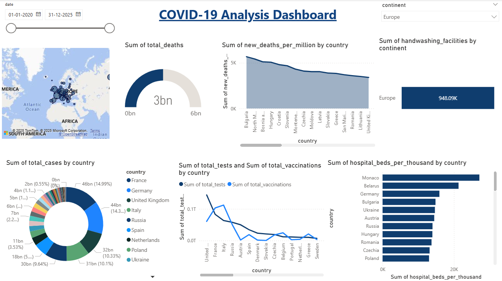

# COVID-19 Analysis Dashboard

A comprehensive Power BI dashboard analyzing COVID-19 data across multiple dimensions including cases, deaths, testing, vaccinations, and healthcare infrastructure.

## 📊 Dashboard Overview

This interactive dashboard provides insights into COVID-19 statistics globally, with focus on:
- Total deaths and cases by region/country
- New deaths per million metrics
- Healthcare infrastructure analysis
- Testing and vaccination coverage
- Regional comparisons and trends

## 🗃️ Data Source

The analysis presented in this dashboard is powered by the following publicly available dataset:
- **Primary Dataset:** [Our World in Data - COVID-19 (Latest Compact)](https://catalog.ourworldindata.org/garden/covid/latest/compact/compact.csv)

## 🖼️ Dashboard Preview

## 📈 Key Metrics Analyzed

### Death Statistics
- **Sum of total_deaths** across regions including:
  - Asia
  - Africa
  - North America
  - Europe
  - Oceania
  - South America

### Mortality Rates
- **Sum of new_deaths_per_million** by country featuring:
  - Hungary, Croatia, Slovenia
  - Czechia, Moldova, Slovakia
  - Greece, Romania, Lithuania
  - United Kingdom and other European nations

### Healthcare Infrastructure
- **Sum of handwashing_facilities** by continent
- **Sum of hospital_beds_per_thousand** by country including:
  - Monaco, Belarus, Germany
  - Bulgaria, Ukraine, Austria
  - Russia, Hungary, Romania
  - Czechia, Poland and others

### Case Statistics
- **Sum of total_cases** by country with percentage distributions
- Case ranges from 2 billion (0.55%) to 30 billion (9.64%)

### Testing & Vaccination
- **Sum of total_tests** by country
- **Sum of total_vaccinations** by country
- Coverage across European nations including:
  - France, Germany, United Kingdom
  - Italy, Russia, Spain
  - Netherlands, Poland, Ukraine and more

## 🌍 Regional Focus

### European Analysis
- Comprehensive data on European countries including:
  - France, Germany, United Kingdom, Italy
  - Russia, Spain, Netherlands, Poland
  - Ukraine, Austria, Denmark, Slovakia
  - Czechia, Belgium, Portugal, Ireland
  - Greece, Sweden and others

## 🛠️ Technical Implementation

**Tool:** Microsoft Power BI   
**Visualizations:** Various charts, maps, and KPIs showing comparative analysis

## 📋 Features

- Interactive filters and slicers
- Regional comparisons
- Percentage distribution analysis
- Healthcare capacity metrics
- Vaccination and testing progress tracking
- Mortality rate monitoring

## 📁 Files

- `COVID-19_Analysis_Dashboard.pbix` - Power BI project file
- `README.md` - This documentation file

## 🔮 Insights

The dashboard enables:
- Identification of high-impact regions
- Healthcare system capacity assessment
- Vaccination program effectiveness tracking
- Mortality rate trend analysis
- Resource allocation planning

## 📄 License

This project contains data based on publicly available COVID-19 statistics.
